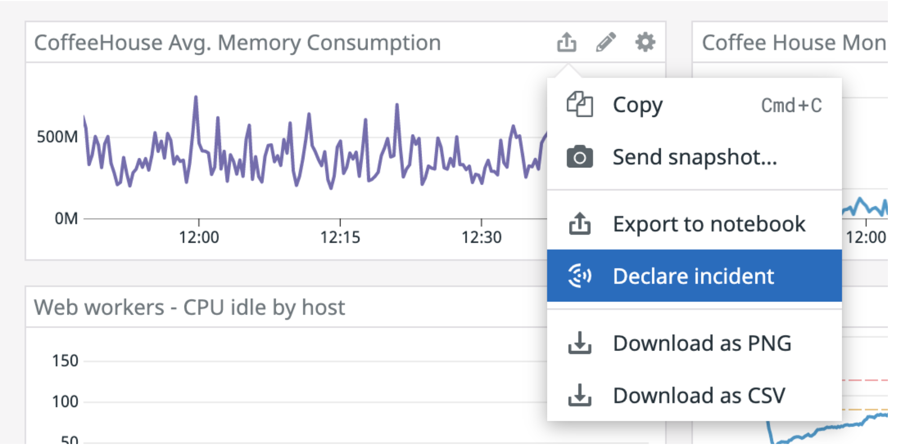
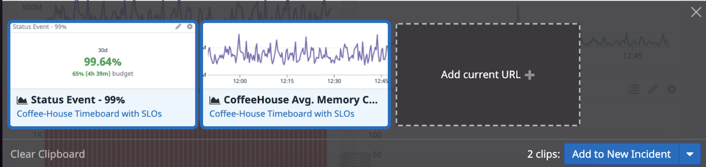
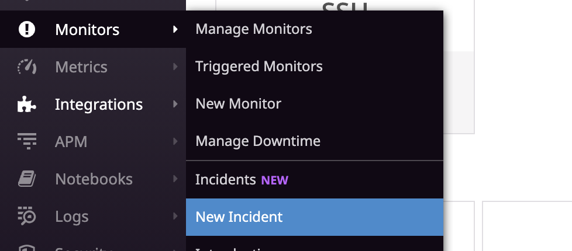
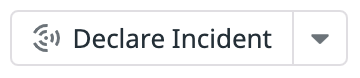

In Datadog, you can declare an incident from several locations within the app. You are going to be declaring one from a monitor, but you could just as easily declare an incident from:
- A dashboard graph:

- The Datadog clipboard: 

- The sidebar:

Navigate to the monitor in the "ALERT" status from the previous step. Click the **Declare Incident** button:

The resulting modal will ask you to assign some properties to the incident:

- Severity - Leave this as unknown for right now, you will come back to this once you know some more about the incident.
- Title - Give the incident a title of `Latency Issue on Homepage`{{copy}}
- Attached Signals - You'll see that Datadog has already included the monitor as a signal that you are raising this incident from. You can attach other signals here by pasting them, but for now just leave it as is.
- Incident Commander - Here you can assign someone to lead the incident investigation. Since the lab account is a standalone account, leave this assigned to you.
- Additional Notifications - You can notify others about this incident. In your normal Datadog account, you would include other people, but not in this lab environment.

When you have finished filling out the fields in the modal, click the **Declare Incident** button at the bottom to complete creation of the incident.