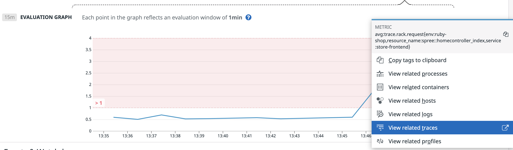
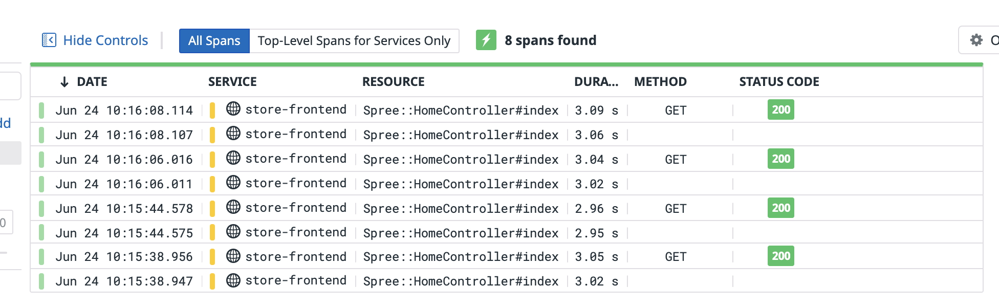
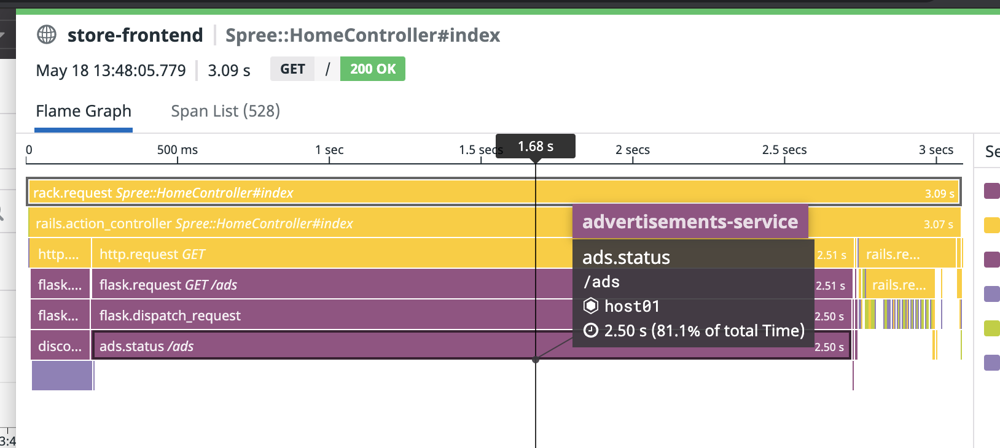
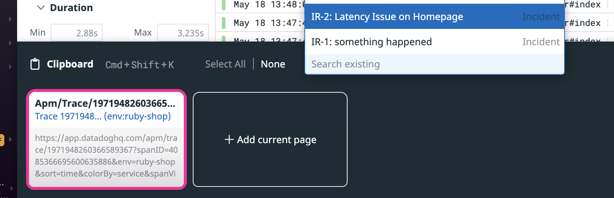

Now that you have a general idea of the issue, its time to determine the root cause and remediate it. In the `Remediation` tab of the incident, you can add related documents for addressing this type of issue. You can also create and assign tasks here related to the incident.

Start by adding one assigned to you for "Look at app traces @[you]" (when you type the `@` symbol, you should get a dropdown to select your Datadog training account). Note that you can adjust the due date or assignees after it is created.

In another tab, take another look at the monitor that alerted you to the issue. Click on the Evaluation Graph and then **Related Traces**:

The resulting page should be a list of traces related to this monitor:

Note that they will be green since the requests are completing successfully, just slowly. Click on one of these traces to open a flamegraph visualizing the execution time of each service involved with the trace. You will see that the culprit here is in fact the ad service taking so long:

Click the **Open Full Page** link at the top to open this trace as a full page. Now you can add this trace to the incident so your coworkers can see what you're referencing. Open the Datadog clipboard (**Cmd/Ctrl + Shift + K**), click **Add current page** and then **Add selected item to...** to add this trace to your incident.

You can now mark the trace investigation task complete in your incident and add an additional one to "Investigate ad service code @[you]". Back in the incident overview, you can also add the "advertisements-service" as a service related to the incident.

Take a look at the `ads-service/ads.py`{{open}} file and see if you can find the source of this latency. 