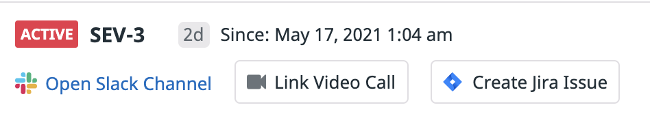

After creating the incident, you are taken to the incident overview page (if you get an Incident Management welcome screen, click **Get Started**). You'll notice some of the fields that you filled out in the previous step here, as well as some new ones.

Communicating with your team during an incident is extremely important. You want to make sure that the response to the incident is handled in a deliberate manner. By knowing the actions that individuals are making in response to an incident, you can properly correlate the observations that you make about your application. Depending on the severity of the incident, you may want to establish a dedicated communication channel. You'll see buttons to add links for chat or video for this specific incident.

The trial organization for this lab does not have any integrations set up. If your organization has integrated [Slack](https://docs.datadoghq.com/integrations/slack/?tab=slackapplicationus) or [Jira](https://docs.datadoghq.com/integrations/jira/), you will also see corresponding options here to chat on Slack or open a Jira issue for this incident.

To learn more about what is going on with your application, take another look at the monitor that alerted you that something was wrong. Since this incident was opened from that monitor, you're able to see it in the "Timeline" tab of the incident. Open the link there in a new tab for the `Monitor for Incident Management Course`.

After some investigation here (full details of how to come to this conclusion are in the Introduction to Application Performance Monitoring course), you've determined that the service affected is `store-frontend` and that requests to the home page are slow.

Back on the incident overview page, you now have a bit more information to describe the incident. Click **Edit**. You can select `store-frontend` as the affected service, and also set `Monitor` as the detection method. Click **Save**.

You now know that customers are affected since it appears to be happening on all requests to the home page. Edit the customer impact to say that "Yes" there is an impact which is `Customers are experiencing long loading times for our site`{{copy}}.

Note that you can adjust the timestamp here - maybe you received a support ticket or did additional research in Datadog that points to an earlier start time. For this lab, leave it at the default.

Upon saving, you'll be prompted to adjust the severity of the incident. Now that you know customers are affected, you likely want to draw some attention to this incident from your team. For this lab, set the severity to `SEV-2`. This is one of the default severity levels provided by Datadog. If you ever want to adjust the severity levels for your team, you can do so in <a href="https://app.datadoghq.com/incidents/settings" target="_datadog">**Incident Management** > **Settings**</a>.