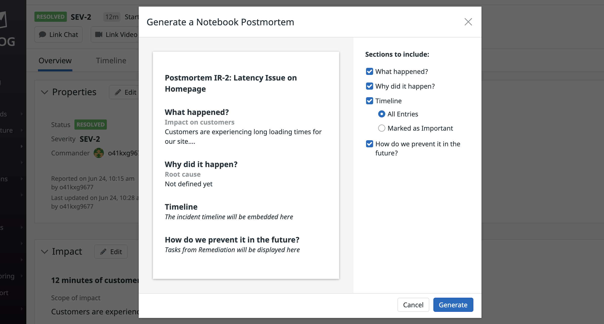
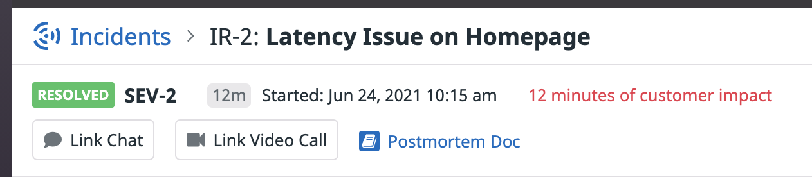

After resolving an incident, its important to reflect on what happened and use the experience as a learning opportunity for the organization. Many times, writing a postmortem becomes a task that is put off and may end up being written too long after the incident. Writing the postmortem too long after the fact can result in a loss of context or important details. Luckily, Datadog will offer to create a Postmortem document for you.

Follow the prompts to generate one for your lab incident:

This populates a Datadog notebook with details from the timeline of the incident including links to Datadog resources referenced during the investigation and remediation.

The document created will have timestamped information uncovered during the incident, but it is important to review the document and add details where appropriate. It will be linked in the incident if you ever need to reference it:

Think about what caused the incident and how it could be prevented in the future. Could a test be added to your release process to catch similar issues?

In our lab scenario, there are probably a few items that could be part of post-incident tasks:
- Formalize a process for adding and removing debug statements from the codebase, maybe by using specific code comment tags.
- Add a latency test for the ad service.

Another thing to consider is if the monitoring that made you aware of the incident was sufficient. Here, the monitor was created specifically for this lab, but in production, its unlikely that the monitor would fit the incident so perfectly. Did the monitor detect the issue quickly enough? Adding a task to review associated monitoring and threshold levels would be another wise post-incident action.

If a similar issue might occur in the future, it also might be a good idea to create a notebook in Datadog to use as a playbook for next time.

Run `grademe`{{execute}} to mark this course as complete before moving on to the course wrap-up.